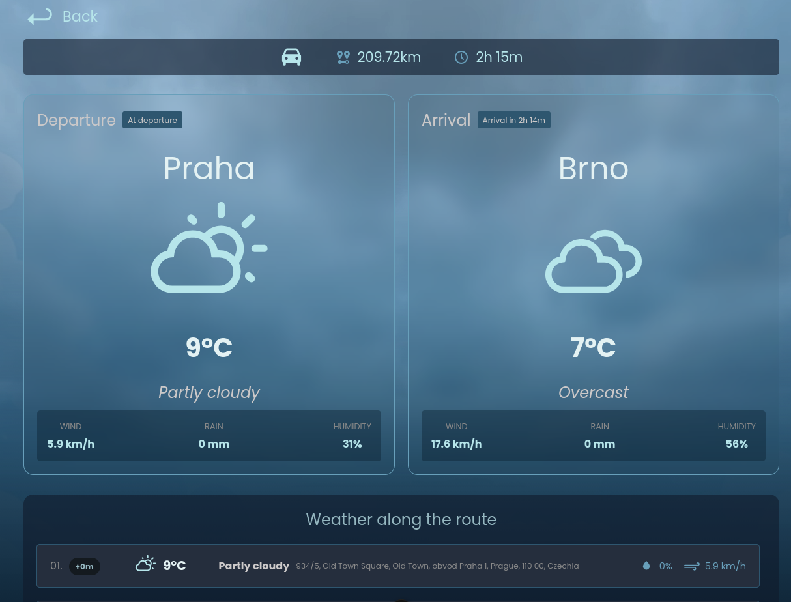
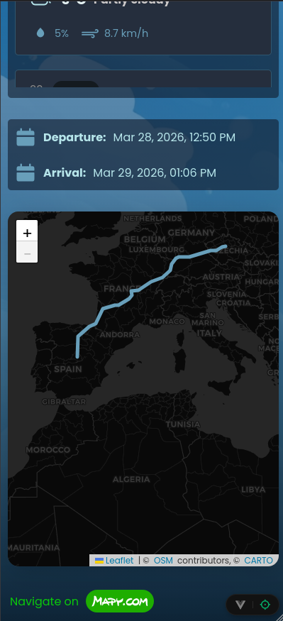
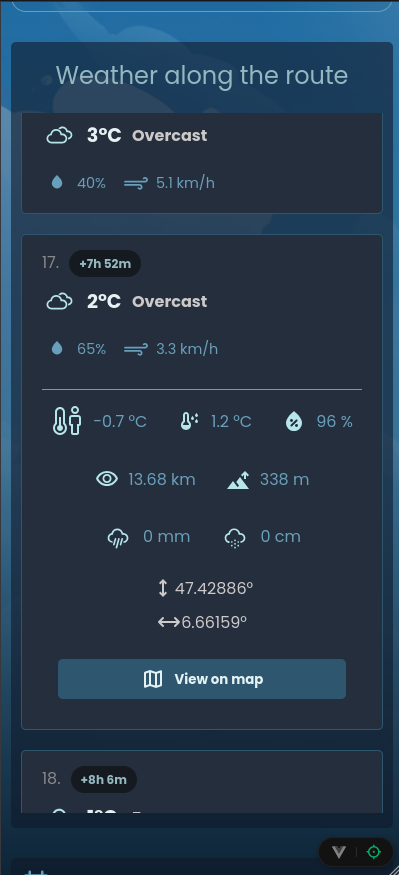
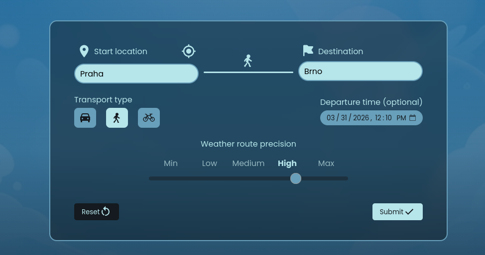

# Weather Route

**Semestrální práce - KAJ 2026**

Interaktivní webová aplikace pro získání počasí na trase.

Aplikace je dostupná [zde]()



## Cíl projektu

Vytvořit nástroj pro řidiče, chodce a cyklisty, který poslouží k zobrazení počasí na jejich trase, aby se na dané počasí mohli připravit. Cestovatel získá detailní přehled o tom, zda ho po cestě čeká déšť, silný vítr nebo špatná viditelnost, a může si tak lépe naplánovat čas odjezdu.

## Funkce aplikace

- **Routing s interaktivním počasím:** Získání trasy podle typu dopravy a extrakce jednotlivých záchytných bodů, ke kterým je přiřazena předpověď odpovídající času dojezdu.
- **GPS lokalizace:** Automatické zjištění přibližné polohy uživatele.
- **Interaktivní mapa:** Vykreslení navigační linie přes zobrazenou mapu (Leaflet), kde je mozné zobrazit každý bod průjezdu.
- **Dynamické UI:** Vizuální zobrazení počasí pomocí změn videa na pozadí dle aktuálního počasí.
- **Historie hledání:** Ukládání (Local Storage) historie vyhledávání pro rychlý opětovný přístup.
- **Offline detekce:** Aplikace reaguje na výpadek internetu vizuálním upozorněním a dočasným zablokováním akcí, aby nedošlo k zamrznutí a pádům při volání sítě.
- **Podpora pro mobilní zařízení:** Aplikace přizpůsobuje UI podle velikosti obrazovky a funguje tak i na mobilních zařízeních.

<div align="center">
  &nbsp;&nbsp;&nbsp; 
  
</div>

### Vyhledávací formulář

- **Startovací lokace** (je možné získat lokaci z GPS)
- **Destinace**
- **Typ dopravy** - auto, pěší, kolo
  - na vybraném typu dopravy závísí vybraná trasa a časy průjezdu
- **Čas odjezdu** - je možné vybrat až dva týdny dopředu, zobrazené počasí pak bude ve vybraný datum a čas
- **Přesnost vyhledávání** - určuje pro kolik bodů na trase se zobrazí počasí (pro kratší trasy nepotřebujeme tolik bodů)

#### Validace

- při odesílání formuláře se validuje pomocí Nominatim API zda počáteční a cílová destinace existuje



## Technická dokumentace

### Technologie

- **Framework:** Vue 3
- **Jazyk:** Typescript, CSS
- **Build systém:** Vite
- **State Management:** Pinia (`searchStore` pro data formuláře, `networkStore` pro stav sítě)
- **Routing:** Vue Router (SPA navigace)
- **Styling a UI:** CSS, SVG ikony [zdroj](https://icon-sets.iconify.design/) .
- **Mapy:** Leaflet
- **Ostatní:** PWA (instalace aplikace do zařízení)

### Využitá API rozhraní

Aplikace komunikuje se 3 bezplatnými, na sobě nezávislými službami:

1. **Nominatim API (OpenStreetMap):** Uživatelův textový vstup transformuje na GPS souřadnice (Geocoding / Reverse Geocoding).
2. **OSRM API (Open Source Routing Machine):** Přijímá počáteční a cílový bod a vrací trasu ve formě bodů průjezdu s kalkulací času dle typu dopravy.
3. **OpenMeteo API:** Získává meteorologická data v bodech průjezdu v přesný čas průjezdu.

### Informace o kódu

- **Vlastní HTTP klient (`apiClient.ts`):** Pro volání API je vytvořen custom wrapper kolem nativního `fetch()`.
- **Extrakce a filtrace bodů (`routePointsHandler.ts`):** Navigační API vrací tisíce bodů, které by zahltily systém počasí. Aplikace zahrnuje logiku, která na základě zvolené přesnosti vyfiltruje pouze potřebné body pro meteorologický dotaz.
- **Network Awareness (`networkStore.ts` & `App.vue`):** Aplikace naslouchá globálním eventům prohlížeče (`online`, `offline`) a mění instanci ve Store. Tak UI informuje a dostupnosti sítě (vyvolají se zablokování tlačítek u GPS a formulářů a zobrazí se zpráva).

---

### Spuštění

1. Instalace zavislosti:

```sh
bun install
```

2. Spusteni lokalne

```sh
bun dev
```

3. Build pro produkci

```sh
bun run build
```
